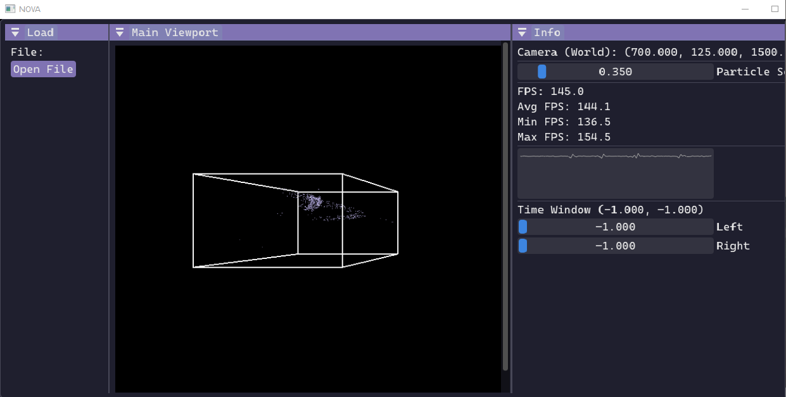
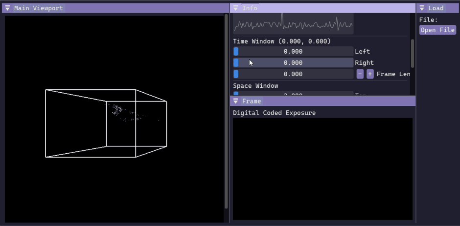
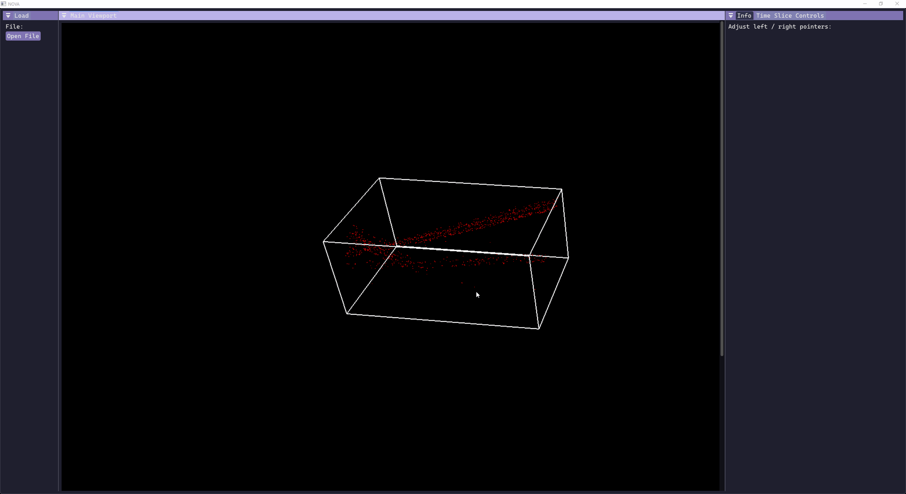

# NOVA
Neuromorphic Optics Visualization Application

See the [table of contents](#table-of-contents) for installation instructions.

# Images





# Table of Contents
- [NOVA](#nova)
- [Images](#images)
- [Table of Contents](#table-of-contents)
- [Installing for users](#installing-for-users)
- [Installing for developers](#installing-for-developers)
  - [Making your dev branch](#making-your-dev-branch)
  - [Dependencies](#dependencies)
    - [VCPKG](#vcpkg)
    - [Visual Studio for MSVC](#visual-studio-for-msvc)
    - [FFmpeg](#ffmpeg)
    - [CMake](#cmake)
    - [Package Installation (\*this one takes ~1hr)](#package-installation-this-one-takes-1hr)
    - [Initialize Submodules](#initialize-submodules)
    - [Building](#building)
- [Running](#running)
  - [Using Visual Studio GUI](#using-visual-studio-gui)
  - [run.ps1](#runps1)
- [TODO](#todo)
- [Dependencies / References](#dependencies--references)

# Installing for users
Our most recent package should be available in the releases section of the repo, with a `.zip` containing instructions to run. Thank you!

# Installing for developers
## Making your dev branch
Don't work off main - make a branch off dev `dev-<yourname>` with
```
git fetch origin
git checkout dev
git pull origin dev
```
Then use your name with `git checkout -b dev-<yourname>`. Then `git push -u origin dev-<yourname>` (the same branch you just made). You can view the branches with `git branch -v -a` - don't mess with the ones that have `remotes/` prepended to them.

You can pull commits from `git pull origin <whatever>` from whatever branch, but for pushing, pull requests follow this order
```
main
    dev
        dev-andrew
        dev-gage
        ...
```

## Dependencies
As a preface, you should
1. Clone somewhere in your `C:` drive (so not in your `WSL` directory). Then if you use VSCode you can open a split terminal with powershell.exe on the left and WSL2 on the right.
2. Try to run your `git` commands in a `WSL` terminal, not `PowerShell`, to prevent line carriage return [issues](https://docs.github.com/en/get-started/git-basics/configuring-git-to-handle-line-endings#re-normalizing-a-repository). `.gitattributes` exists, so this should be mitigated.
3. Expect installs (i.e. `vcpkg`) to require a restart of the terminal / `VSCode` instance.

### VCPKG
You don't have to make/place it in `C:\Dev\`, that's just what I use because it is convenient.
```
git clone https://github.com/microsoft/vcpkg.git C:\Dev\vcpkg
cd C:\Dev\vcpkg
git checkout -b fmt-10.2.1 b8ec6abf5d
.\bootstrap-vcpkg.bat
```

1. Make an environment variable `VCPKG_ROOT` so you can access it with `$env:VCPKG_ROOT$` anywhere in powershell / `%VCPKG_ROOT%` in `cmd.exe`.
2. Add `C:\Dev\vcpkg` to your PATH as well, so you can run `vcpkg` commands from anywhere. For example, I have a key value pair in my PATH as `VCPKG_ROOT` `C:\Dev\vcpkg`.

`fmt` is problematic. If you `cd $env:VCPKG_ROOT` and `git log --oneline --grep="\[fmt\]"` you will see we need to step back to the proper vcpkg hash, to enforce lower usage. Otherwise, we get a conflict when using `dv-processing` which erroneously states any version of fmt `>=8.1.1` works. Hence the checkout to an older version of `vcpkg` that supports it.

### Visual Studio for MSVC
For MSVC, download [Visual Studio 2022](https://visualstudio.microsoft.com/downloads/).

Technically, you don't need the IDE, just the MSVC compiler. You should check mark these items when you have downloaded and opened the installer:
- Desktop development with C++
- For safety wouldn't hurt to click MSVC 142 as well

### FFmpeg
To save the window and renders to video, [FFmpeg](https://ffmpeg.org/download.html) is used.

1. From `cmd` run `winget install Gyan.FFmpeg` or download the FFmpeg executable manually [here](https://ffmpeg.org/download.html).

The command line installation should automatically configure FFmpeg in your `PATH` variable.

If you choose to manually download, ensure that environment variable is set and matches the file location. You can test this by opening a new terminal and typing `ffmpeg`.

### CMake
You will need [cmake](https://cmake.org/download/) as well if you do not have it.

Note that anything that updates your path variable will not immediately work in an already open terminal. You should reload any terminals or VSCode.

### Package Installation (*this one takes ~1hr)
The `--triplet=x64-windows` will install these libraries to be used in your system. If you want them local to the project (not recommended) you should remove that. 

1. Run `vcpkg install --triplet=x64-windows dv-processing glew glfw3 glm eigen3` in the project root (this can take up to an hour, run this and come back in a while).
2. You will need [cmake](https://cmake.org/download/) as well if you do not have it.

### Initialize Submodules
1. Run `git submodule update --init`

### Building
You should create a `build` directory once everytime you make major changes, or at least once per minor changes, followed by repeated recompilation in `run.ps1`.

`cmake -S . -B build -DCMAKE_TOOLCHAIN_FILE="$env:VCPKG_ROOT/scripts/buildsystems/vcpkg.cmake" -DCMAKE_BUILD_TYPE=Release` builds in release mode, which doesn't come with debugging symbols.

# Running
## Using Visual Studio GUI
If you want to use VS for debugging, you can run `explorer.exe .` in your terminal and open `build/`. You should see a `.sln` extension, like `nova.sln`. Double click that. I only use VS to debug sometimes as I personally just use CLI + VSCode to develop at this point.

## run.ps1
`.ps1` files are PowerShell scripts. Open PowerShell in the terminal (type `powershell.exe` if it isn't the native Windows VSCode terminal).

Run `run.ps1`. You can look at it to see what it does.

# TODO
1. Make a `vcpkg.json` manifest? It is already a pretty simple vcpkg install though.

# Dependencies / References

- [LANL](https://lanl.gov/) for project idea, guidance, and support with features and logic
- [OpenGL](https://www.opengl.org/) and [Dear ImGui](https://github.com/ocornut/imgui)
- Various other libraries as found in files (GLFW, GLEW, GLM, Eigen, CMake, dv-processing, fmt, ffmpeg, etc.)
- [Dr. Shinjiro Sueda](https://people.engr.tamu.edu/sueda/index.html) for teaching us graphics and for any course-given skeleton code used in any cited files headers